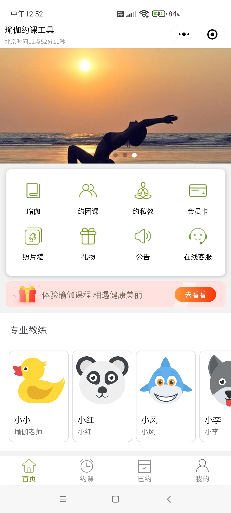
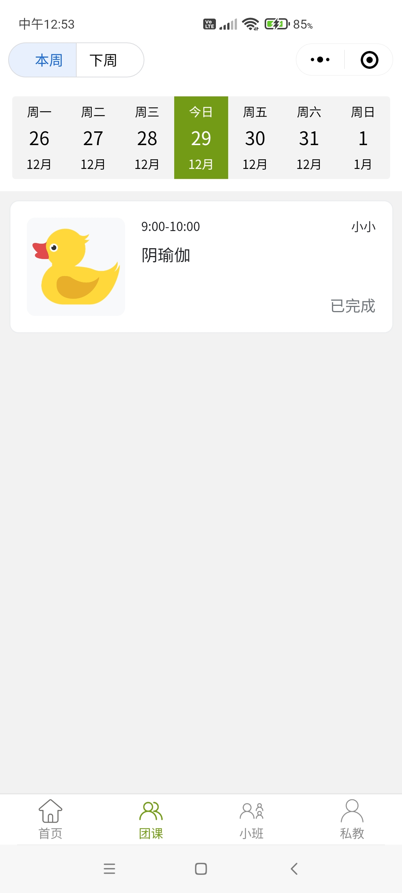

# 瑜伽约课微信小程序

瑜伽约课工具是一款免费开源，专注于会员管理和数字化、互联网化商业业务的小程序。

它使用 6 种原生编程语言和一个世界级数据库开发，前端和后端都不依赖任何第三方服务，有极出色的性能和根据业务增长弹性扩展的能力。

它以瑜伽馆作为背景开发，在长期的实践与磨合中，模块化和抽象化了可以处理各种业务要素的功能块，可以根据业务要求，进行灵活调整和重组。

它不仅可以用于瑜伽馆，也可用于管理便利店、饭店、汽修店、美容按摩健身教培等等，也可以简单的切换成微信公众号，或者完全独立于微信的网站。

而且，它将公开全部源代码和相应文档，其包括安装步骤、源代码解析、开发经验……，也包括各种最新技术的执行和运用。对开发人员、计算机专业的学生或者对开发小程序和网站有兴趣的人士都有一定的价值。







## 开发环境

- 微信开发工具
- Go 语言
- PostgreSQL 数据库

## 安装和配置

安装和配置小程序的详细步骤，请参见[说明文档](https://lucidu.cn/article?name=%E5%AE%89%E8%A3%85%E5%92%8C%E9%85%8D%E7%BD%AE)。

## 后端

Windows 系统 PowerShell 终端可使用如下命令启动后端服务器：

```ps
# 使用恰当的参数替换中文描述的内容
$ENV:DATA_SOURCE_NAME="host=数据库公网IP port=数据库侦听端口 user=数据库用户名 password=数据库密码 dbname=数据库名称 sslmode=disable";$ENV:AUTH_URL="https://api.weixin.qq.com/sns/jscode2session?appid=小程序Id&secret=小程序密钥&grant_type=authorization_code&js_code=";$ENV:SECRET="长度32的字符串"; go run main.go
```

## 前端

在开发前端的过程中，最让人困扰和影响代码质量的，莫过于需要频繁查询特定HTML元素，然后要命名一个相关变量，最后还要绑定它的如鼠标单击的特种事件。我们将通过几行代码来解决这些问题。

```html
  <custom-drawer bind="customDrawer"></custom-drawer>
  <custom-header title="瑜伽" bind @click="showDrawer"></custom-header>
```

我们用 `bind` 属性来标记元素，然后用该属性的值作为 `window` 对象的变量缓存该元素。例如 `window['customDrawer']`。

我们用  `@` 作为前缀，来绑定元素的事件。而实现这种规则的代码如下。

```javascript
document.querySelectorAll('[bind]').forEach(element => {
  if (element.getAttribute('bind')) {
    window[element.getAttribute('bind')] = element;
  }
  [...element.attributes].filter(attr => attr.nodeName.startsWith('@')).forEach(attr => {
    if (!attr.value) return;
    element.addEventListener(attr.nodeName.slice(1), evt => {
      window[attr.value](evt);
    });
  });
})

```

更多内容请查阅[在线文档](https://lucidu.cn/article?name=%E5%89%8D%E7%AB%AF)。

## 在线示例


## 待解决事项

- 某些图标在高清屏幕下锯齿，例如底部栏的约课图标

    
- 执行用户约课候补
- 团课图标线条过粗，应通过路径偏移减少 4 个像素
- 预约课程页面天数偏移不应初始化为-1，否则会导致显示错误


## 相关文档

- https://developer.mozilla.org/en-US/docs/Web/HTML/Element/link

## 支持和赞助


