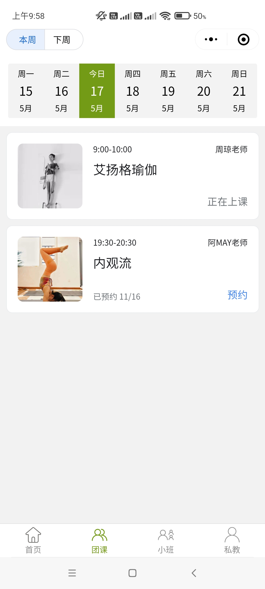
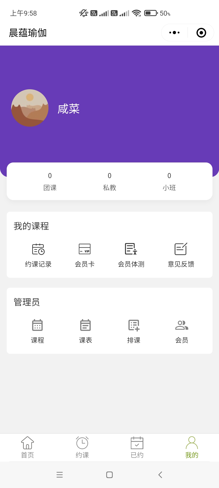
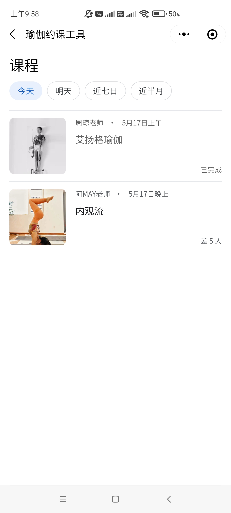
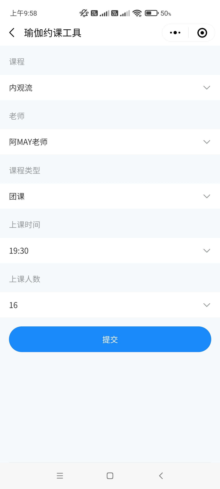
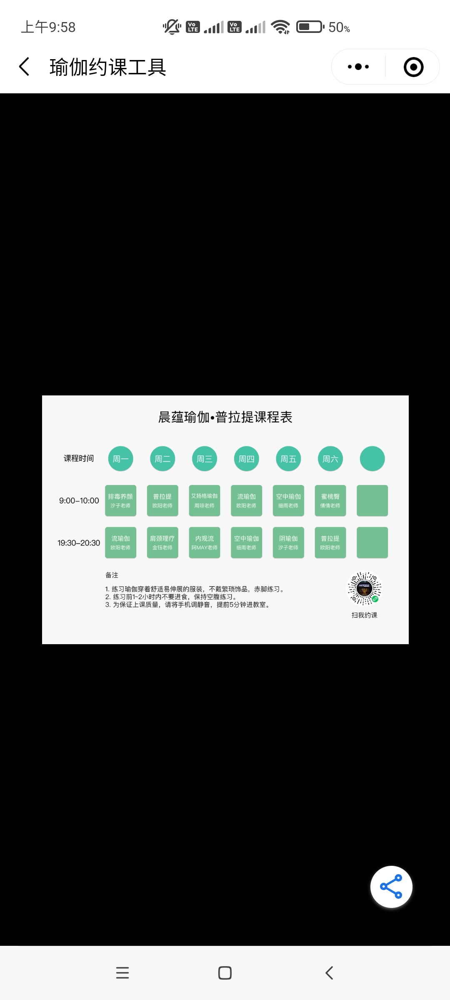
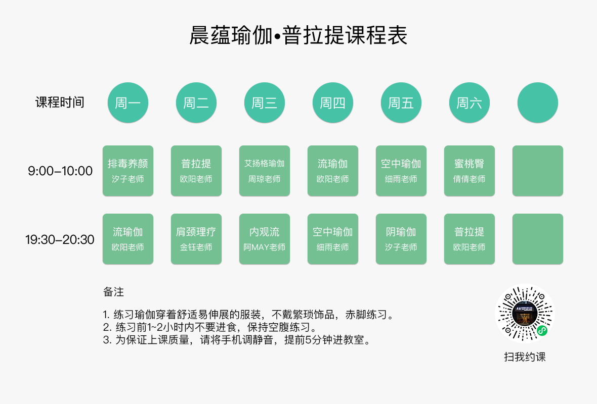

# 瑜伽约课微信小程序

一个使用 Rust 开发的，用于瑜伽约课的微信小程序。

该程序，包括后端服务器、数据库、浏览器管理员前端、微信小程序，再加上相关的架设和配置，有一定的复杂性。但同时也是一个训练开发能力的很好的项目。

除一些敏感信息外，已公开包括数据库的所有代码。

- [部署](/Deploy)
- [后端服务器](/server)
- [前端](/WebAssembly/weixin)
- [设计资源](/资源)

## 开发环境

- 微信开发工具
- Rust 语言
- PostgreSQL 数据库

## 微信小程序截图

<div>








</div>

### 课程表



## 本地运行

1. 安装 [PostgreSQL](https://www.postgresql.org/download/)
2. 安装 [Rust](https://www.rust-lang.org/tools/install)
3. 安装 [微信开发者工具（稳定版 Stable Build）](https://developers.weixin.qq.com/miniprogram/dev/devtools/stable.html)

## 后端

Windows 系统 PowerShell 终端可使用如下命令启动后端服务器：

```ps
# 使用恰当的参数替换中文描述的内容
$ENV:DATA_SOURCE_NAME="host=数据库公网IP port=数据库侦听端口 user=数据库用户名 password=数据库密码 dbname=数据库名称 sslmode=disable";$ENV:AUTH_URL="https://api.weixin.qq.com/sns/jscode2session?appid=小程序Id&secret=小程序密钥&grant_type=authorization_code&js_code=";$ENV:SECRET="长度32的字符串"; go run main.go
```

## PowerShell 命令行

在开发中用到的，一些简化文件操作的 PowerShell 命令。

```ps

将当前目录切换为 Rust 模块所在的目录，然后创建单独的 Rust 源代码文件，最后获取该目录下的所有 Rust 源代码文件，进行过滤后，将其全部写入 mod.rs，以便在其他位置的代码可以使用该模块内的所有代码
$dir="C:\Users\Administrator\Desktop\file\yg\server\src";$name="models";$filename="settings.rs";Set-Location $dir;New-Item -Type "directory" $name;Set-Location $name; New-Item mod.rs;New-Item $filename;Get-ChildItem | Where-Object {$_.Name -ne "mod.rs"} | Split-Path -LeafBase | Join-String -FormatString "pub mod {0};`r`n" | Set-Content -Path .\mod.rs;` 

用于创建微信小程序页面文件夹，和其包含的 4 个同名文件
$name="adminLesson";$dir="C:\Users\Administrator\Desktop\file\yg\miniprogram\pages";Set-Location $dir;New-Item -Type "directory" $name;Set-Location $name;New-Item $name".js";New-Item $name".wxml";New-Item $name".wxss";New-Item $name".json";
```